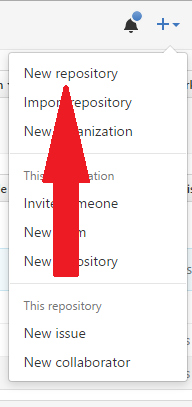
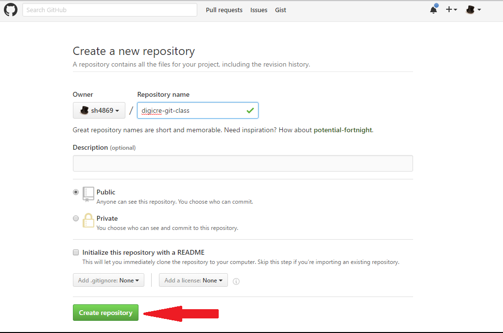

# 5. リモートレポジトリ、ローカルレポジトリ

## リモートレポジトリ

今までみなさんは自分のPCの上で作業をしてきました。しかし、どこかに共有しておきたいなと感じることはないでしょうか。たとえば次のようなケースが考えられます。

* 新しいPCにプログラムを移行したい
* 他人にコードを共有したい

このようなことがGitでは簡単にできます。

インターネット上にあるGitのプロジェクトのことを **リモートレポジトリ** といいます。さきほど作ったGitレポジトリ （**ローカルレポジトリ**）にリモートサーバーやWebサービスを利用してリモートレポジトリを追加することもできます。

## GitHub

### 新しいレポジトリの作成

GitHubは、Gitホスティングサービスの1つです。GitHub上に自分の作ったプロジェクトを保存したり、共有したりすることができます。とりあえず先ほど作ったアカウントでログインして、右上にある＋ボタンをクッリクしてください。




このようなメニューが出てきたら、「New Repository」を選択してください。新しくGitHub上にレポジトリを作成する画面に移ります。



Repository name に「digicre-git-class」と記入したら、Create repositoryボタンを押してください。

### リモートレポジトリを設定する

これでGitHub上にレポジトリを作成できました。Gitレポジトリにリモートレポジトリを設定することで、ローカルでのGitの履歴をGitHub上で共有・閲覧することができます。

先程作成した digicre-git-classのコードを、GitHub上のリモートレポジトリにあげてみましょう。先程Create repository後に遷移したページで、上の方にあるHTTPというボタンをクリックしてください。


表示されているURLをCtrl + Cでコピーしてください。そして、git bashに戻り次のようにコマンドを実行します。

```bash
git remote add origin (さっきのURL)
```

これでoriginという名のリモートレポジトリを追加することができました。

## git push

早速ローカルにあるGitの変更をpushしてみましょう。次のコマンドを実行してみてください。

```
git push origin master
```

これはローカルのmasterブランチをorigin という名前のリモートレポジトリに同期するという意味のコマンドです。このコマンドを実行すると、GitHubのユーザー名とパスワードを求められます。入力してコマンドが終了したことを確認したら、さきほどのWebページに戻り、リロードしてみてください。main.cがページ上に表示されているのがわかります。このようにして、リモートレポジトリに変更を同期することが可能です。

## git pull

リモートレポジトリの方に変更が加えられて、それをローカルの方に同期したいと考えることもあるでしょう。そのときは次のようなコマンドが使えます。

```
git pull origin master
```

これはリモートレポジトリoriginのmasterをローカルの現在いるブランチに適用するという意味のコマンドです。今回はリモートレポジトリ上での変更は行わないので詳しく記述しません。またどこかの機会で充実させます。

## git clone

リモートレポジトリのコードをそのままローカルに持ってくることも可能です。この講座の資料はすべてGitで管理されていますから、試しにローカルへ持ってきてみましょう。

```
cd ..
```

上のコマンドを実行することでDevelopフォルダに移動することができます。そこで、次のコマンドを実行してみてください。

```
git clone git@github.com:SIT-DigiCre/SummerCampProgrammingGitLectureMaterial2016.git
```

すると、このような表示がでるのではないでしょうか。

```
Cloning into 'SummerCampProgrammingGitLectureMaterial2016'...
remote: Counting objects: 113, done.
remote: Compressing objects: 100% (81/81), done.
remote: Total 113 (delta 37), reused 95 (delta 21), pack-reused 0
Receiving objects: 100% (113/113), 435.79 KiB | 284.00 KiB/s, done.
Resolving deltas: 100% (37/37), done.
Checking connectivity... done.
```

これでローカルに今見ている資料をもってくることができました。`cd  SummerCampProgrammingGitLectureMaterial2016/`を実行すると、この講義資料があります。

## まとめ

* リモートレポジトリとローカルレポジトリがある
* `git remote add origin URL`でリモートレポジトリを追加できる
* `git push`でローカルの変更を同期できる
* `git pull`でリモートレポジトリの変更をローカルに同期できる
* `git clone`でリモートレポジトリをローカルに下ろすことも可能
